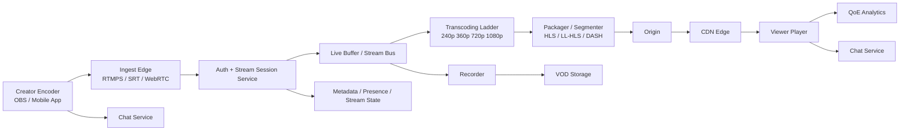
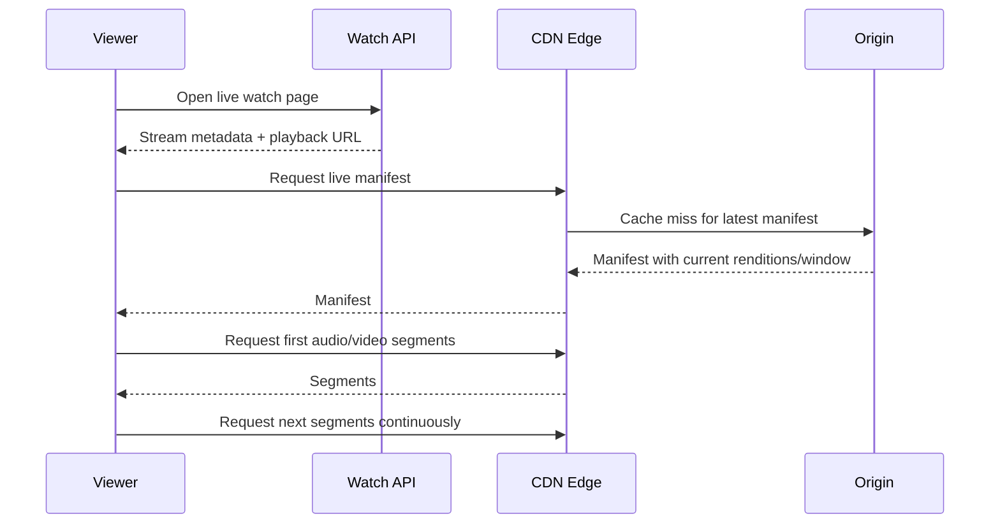
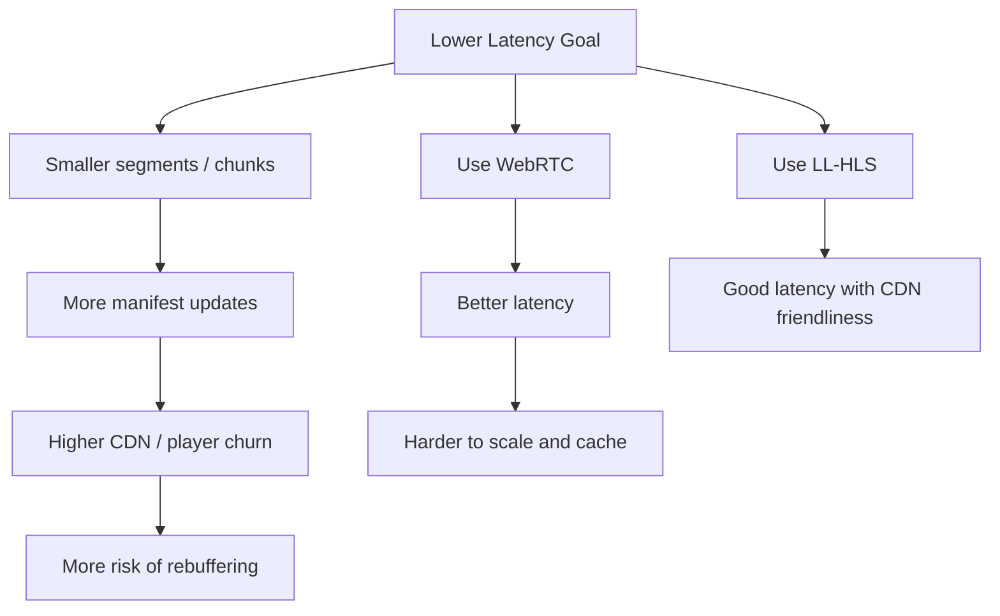

### System Design: Live Video Streaming Architecture

**Scope:**
- One-to-many live broadcast (YouTube Live / Twitch style)
- Creator goes live -> platform ingests, transcodes, packages, and delivers to viewers
- Includes media path, latency tradeoffs, recording-to-VOD, and chat separation

**Core difference vs uploaded video:**
- Uploaded video can be processed asynchronously after upload finishes
- Live video must be processed continuously in near real time
- Every stage is a race against wall-clock latency

**End-to-end architecture:**


**Media path in plain English:**
```text
Creator publishes live stream
  -> ingest edge accepts stream and authenticates stream key
  -> stream is buffered and fanned into processing pipeline
  -> transcoder generates multiple bitrates/resolutions
  -> packager cuts small media chunks and updates live manifest
  -> origin stores current live window
  -> CDN distributes chunks to viewers
  -> player adapts quality continuously
```

**1. Ingest layer:**
- Receives stream from OBS/mobile/desktop encoder
- Validates stream key, account permissions, geo/policy rules
- Terminates upload protocol: usually `RTMPS` or `SRT`; sometimes `WebRTC` for ultra-low latency
- Normalizes timestamps, handles reconnects, detects stream health

**Why ingest edges exist:**
- Keep creator upload close to a nearby POP/region
- Reduce packet loss and long-haul upload issues
- Shield core transcoding cluster from direct internet traffic

**2. Stream session service:**
- Maps `stream_key -> active ingest session`
- Stores state: created, live, reconnecting, ended
- Tracks current ingest region and failover target
- Prevents duplicate publishers on the same stream key

**3. Live buffer / stream bus:**
- Short rolling buffer between ingest and transcoding
- Smooths jitter from encoder/network
- Decouples ingest spikes from worker hiccups
- This is not the viewer delivery path; it is internal live-media plumbing

**4. Transcoding ladder:**
- Generate multiple renditions in parallel: e.g. 240p, 360p, 480p, 720p, 1080p
- Keep renditions keyframe-aligned so the player can switch quality cleanly
- Audio often transcoded separately once and reused
- GPU/ASIC acceleration often used because this is the most expensive stage

**5. Packaging / segmentation:**
- Cut video into small chunks for adaptive playback
- Update manifest/playlist as new chunks arrive
- Common playback protocols:

| Protocol | Typical use | Latency | Notes |
|---------|-------------|---------|------|
| HLS | Broad compatibility | ~10-30s | Safest, simplest |
| LL-HLS | Lower-latency scale delivery | ~2-6s | Good CDN fit |
| DASH | Similar to HLS in some ecosystems | ~4-15s | Less universal than HLS |
| WebRTC | Real-time interactive | sub-second | Expensive at scale, harder via CDN |

**Important distinction:**
- **Ingest protocol** and **viewer playback protocol** are often different
- Example: creator sends `RTMPS`, viewers watch via `LL-HLS`

**6. Origin + CDN:**
- Origin stores current live window and manifests
- CDN edges cache the newest segments very aggressively
- Popular streams become edge-hot quickly
- CDN absorbs viewer fan-out so origin is not hit by every watch request

**7. Player behavior:**
- Fetch live manifest
- Start a few segments behind real live edge for safety
- Measure throughput and buffer health
- Switch between bitrates without rebuffering when possible
- Stay close to live edge while avoiding stalls

**Viewer startup sequence:**


**8. Chat, reactions, and counters are separate:**
- Chat is usually WebSocket-based and independent from media delivery
- Reactions, likes, and viewer counts are separate real-time services
- Never couple chat latency to video segment delivery

**9. Recording and live-to-VOD:**
- Record the incoming stream or packaged renditions while live
- When stream ends:
  - finalize recording
  - generate VOD metadata
  - optionally re-transcode for better long-tail quality
  - attach chaptering, thumbnails, captions later

**10. Key data/state you track:**
```text
live_streams:
  stream_id
  creator_id
  stream_key_hash
  status            # created, live, reconnecting, ended
  ingest_region
  started_at
  ended_at
  playback_url
  dvr_enabled
  recording_status
```

**11. Main bottlenecks:**
- Ingest bandwidth from creators
- Real-time transcoding capacity
- Packaging latency
- CDN freshness near live edge
- Player rebuffering under network volatility

**12. Important failure cases:**
- Encoder disconnects briefly -> keep session warm for reconnect window
- One transcoder dies -> restart rendition worker without killing entire stream
- CDN edge serves stale manifest -> viewers drift behind live edge
- Audio/video timestamp drift -> playback desync
- Chat spike -> separate scaling path from media

**13. Scaling patterns:**
- Partition ingest by stream key / region
- Dedicated worker pools for premium / large streams
- Autoscale transcoders by active stream count and bitrate ladder size
- Multi-region failover for ingest and control plane
- Different latency tiers: standard live vs ultra-low-latency live

**14. Latency tradeoff graph:**


**15. Where Kafka fits and where it does not:**
- Kafka can fit:
  - analytics events
  - stream state changes
  - moderation / notifications
  - recommendation and watch telemetry pipelines
- Kafka usually does **not** carry the actual viewer media path
- Viewers consume manifests + media chunks from CDN/origin, not Kafka

**Typical interview answer stack:**
- Creator ingest via `RTMPS`/`SRT`
- Internal live buffer + transcoding ladder
- Package to `HLS` or `LL-HLS`
- Deliver through CDN
- Chat via WebSocket
- Recording pipeline for VOD

**Rule of thumb:** Live streaming is a latency-budget problem. Keep ingest close to creators, isolate real-time transcoding, package into CDN-friendly chunks, and separate media delivery from chat/control/analytics. For internet-scale live video, the winning pattern is usually `RTMPS ingest -> real-time transcode -> LL-HLS/HLS playback via CDN`, not WebRTC end-to-end for every viewer.
